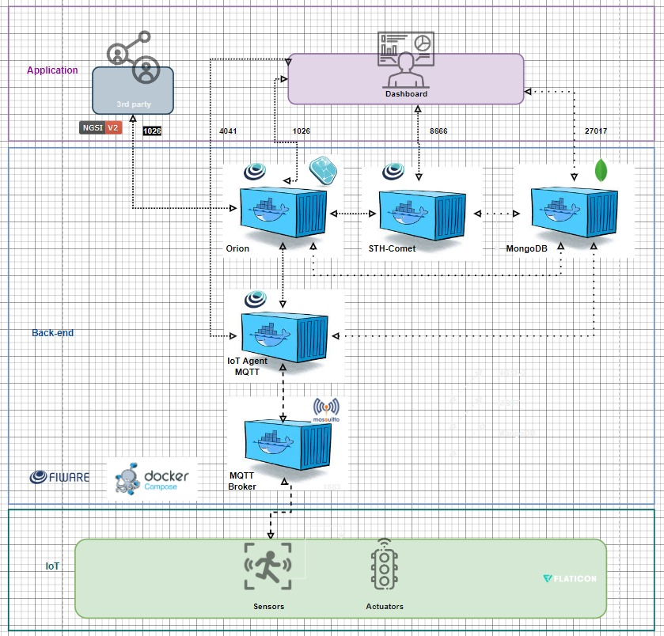

# SPRINT03-EDGE
Este projeto utiliza um ESP32 e um sensor DHT22 para monitorar as condições climáticas nas pistas de Fórmula E. O sistema captura dados de temperatura e umidade em tempo real e os envia para uma plataforma Fiware através do protocolo MQTT, permitindo a análise precisa das condições ambientais. Essa solução visa melhorar o monitoramento e a tomada de decisões durante as corridas.
## Componentes Utilizados
- ESP32
- Sensor de temperatura e umidade DHT22
- Jumpers e protoboard
## Bibliotecas Utilizadas
- DHT22
- DHT sensor library
- PubSubClient
## Como utilizar
- Primeiramente é necessário criar uma VM ubuntu em um cloud de sua escolha, para este projeto escolhemos o azure
- Logo em seguida é necessário baixar o fiware na VM ja criada
- Após instalação abrir as portas 1026/TCP - Orion Context Broker, 1883/TCP - Eclipse-Mosquito MQTT, 4041/TCP - IoT-Agent MQTT, 8666/TCP - STH-Comet
- Em seguida abra o projeto Wokwi(link no final) e mude o endereço ip para o endereço publico de sua vm
- após tudo configurado abra a colection no postman, primeiro teste o halth check para verificar a conexão com a vm, logo em seguida no "Provising Sensor" para a criação dos sensores, depois listar os dispositivos e então ver os dados capturados no sth-commet
## Nossa arquitetura IOT

## Links importantes
- Wokwi: [wokwi](https://wokwi.com/projects/410403677713263617)
- GitHub passo a passo para instalação do fiware: [git](https://github.com/fabiocabrini/fiware)
- Video explicativo: [youtube](https://youtu.be/croMWW0s89w)
## Participantes
- Gustavo Morais RM554972
- Leonardo Novaes RM554807
- Miguel Carmo RM557622
- Estevam Melo RM555124
